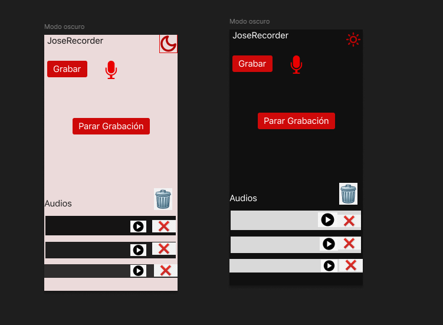

# DISEÑO DE PANTALLA DE GRABACIÓN QUE DISPONGA DE LOS SIGUIENTES ELEMENTOS:

## Botón para grabar/ parar grabación
## Listado de audios grabados 
## Elemento para reproducir individualmente un audio grabado 
## Botón para eliminar todos los audios guardados o cada uno individualmente

El diseño se realizó en la herramienta de desarrollo figma.

