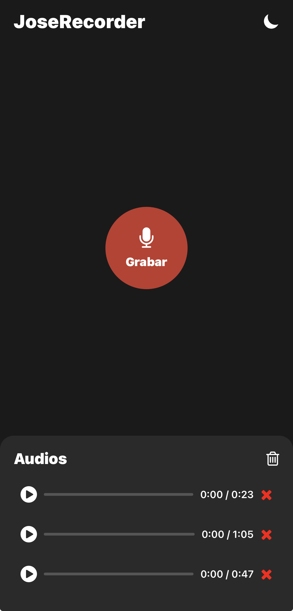

# IMPLEMENTACIÓN DE DISEÑO DE PANTALLAS

## Pantalla

## ¿Qué hemos hecho para que tenga ese diseño?

Para realizar este diseño en react native, hemos hecho uso de las etiquetas View para simular
los contenedores