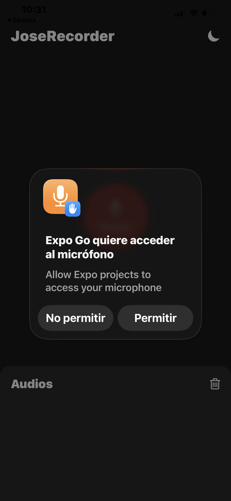
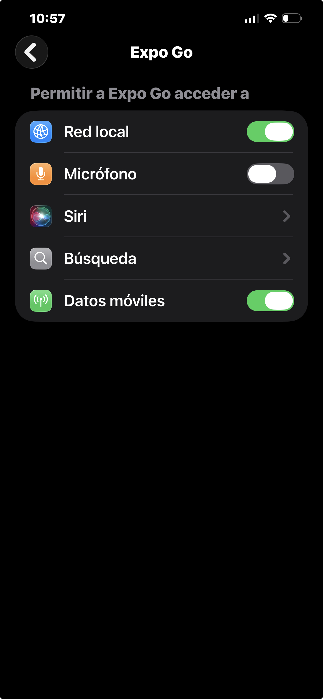
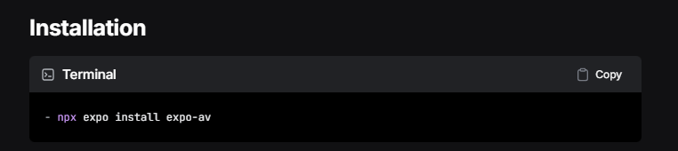
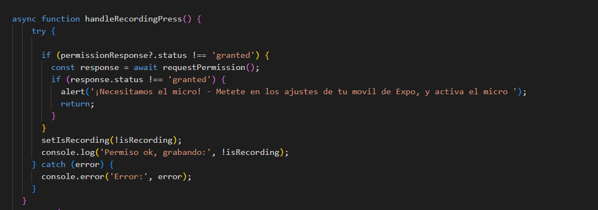

# SOLICITUD DE PERMISOS DE GRABACIÓN DE AUDIO PARA EL USUARIO.

## Contexto:

La aplicación debe tener los permisos adecuados previamente concedidos por el usuario para grabar un audio. De lo contrario, se le pedirán mediante un PopUp del sistema operativo nativo del dispositivo móvil en el cual se está visualizando la aplicación.
Ejemplo:
En mi caso, se trata de un IOS (iphone 12 pro max):

## ¿Qué está sucediendo exactamente?

"Internamente" lo que sucede es que tenemos, valga la redundancia en la configuración de la aplicación en la cual estamos ejecutando la aplicación el permiso del iphone desactivado, tal y como se aprecia en la siguiente imagen:

El usuario, al conceder esos permisos, lo que hace es "presionar" ese botón de forma automática para así, poder empezar a grabar audios.
Una vez se le concede permiso al usuario, no se le vuelve a pedir en toda la sesión.

## ¿Por qué se hace esto?

Los sistemas operativos modernos (iOS y Android) implementan un modelo de permisos explícitos para proteger la privacidad del usuario. El micrófono es considerado un recurso sensible porque permite capturar conversaciones, sonidos del entorno y datos personales sin que el usuario necesariamente lo note.
Por eso, antes de que una app pueda acceder al micrófono, el sistema operativo exige que:

- El desarrollador declare en el proyecto que su app necesita ese permiso (Info.plist en iOS, AndroidManifest.xml en Android).
- El usuario lo acepte explícitamente en tiempo de ejecución, la primera vez que la app lo necesita.

Esto garantiza que ninguna aplicación pueda grabar audio de forma silenciosa o sin consentimiento. Si el usuario deniega el permiso, la app simplemente no puede acceder al micrófono, independientemente de lo que haga el código.

## ¿Cómo se hace esto en código?

Para llevar a cabo esta necesidad técnica, hay que hacer la siguiente lista de pasos:

1. Primero necesitas instalar expo-av, que es la librería oficial de Expo para trabajar con audio y vídeo.

Se usa npx expo install en lugar de npm install porque Expo elige automáticamente la versión compatible con tu proyecto.

2. Importar lo necesario
En el componente en el que vayas a utilizar la librería, importas Audio desde expo-av y los hooks de React que vas a necesitar:

## POR EJEMPLO: 

 - javascriptimport { Audio } from 'expo-av';
 - import { useState } from 'react';

3. Solicitar el permiso

Audio.usePermissions() es un hook que te devuelve dos cosas:

- permissionResponse → el estado actual del permiso (granted, denied, undetermined)
- requestPermission → una función para lanzar el popup nativo del móvil

Y aquí declaras la variable constante con el Hook correspondiente que utilizarás en una función en tu código: 
javascriptconst [permissionResponse, requestPermission] = Audio.usePermissions();

4. Gestionar lógica de permiso

Cuando el usuario pulsa el botón de grabar, comprueba si ya tiene el permiso concedido. Si no lo tiene, lo solicitas. Si lo deniega, muestras un aviso:

Eso se logra apreciar justo en el trozo de código que se aprecia en la siguiente imagen:

Explicación del código: 

En primer lugar, se declara una función 'async' - 'asincrona':
 Una función asíncrona es una función que puede hacer tareas que tardan tiempo, como esperar la respuesta del móvil, sin bloquear el resto de la app. Cuando le pides permiso al sistema, tu app tiene que esperar a que el usuario pulse "Permitir" o "Denegar". Si fuera una función normal, la app se quedaría congelada esperando. Con async y await, la app sigue funcionando con normalidad mientras espera.
La función handleRecordingPress es una función asíncrona que se ejecuta cuando el usuario pulsa el botón de grabar. Primero comprueba si el permiso del micrófono ya está concedido, y si no lo está, lanza el popup del móvil con await requestPermission() esperando la respuesta del usuario sin bloquear la app. Si el usuario deniega el permiso, muestra un alert y sale de la función con return. Si lo acepta, cambia el estado isRecording para indicar que se está grabando. Todo esto está dentro de un try/catch para que si ocurre cualquier error inesperado, se muestre por consola sin que la app se rompa.

