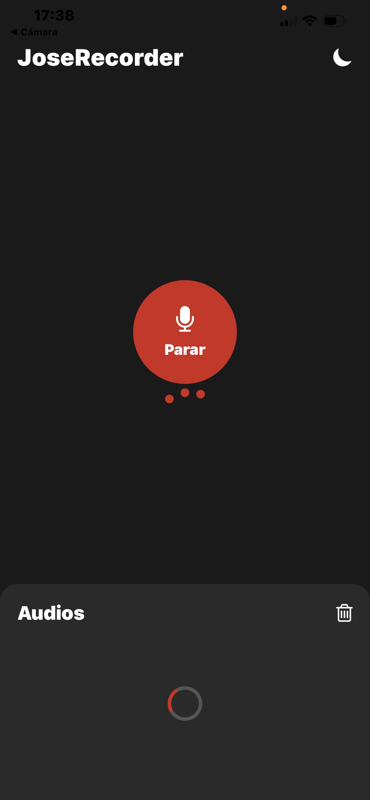

# Ejercicio 5 - Componente de carga

## ¿Qué se ha implementado?
Se ha creado un componente propio `LoadingSpinner` que muestra una animación 
de carga en dos momentos clave de la aplicación: al cargar las grabaciones 
iniciales y durante el proceso de grabación.

## ¿Cómo funciona?

### El componente LoadingSpinner
Es un círculo que gira continuamente usando **React Native Reanimated**:

Una biblioteca avanzada de código abierto, que permite crear animaciones e interacciones complejas y fluidas en aplicaciones de React Native

### Lugar 1 - Al cargar las grabaciones iniciales
Se usa un estado `isLoading` que se activa antes de recuperar los audios 
del AsyncStorage y se desactiva cuando termina:

useEffect(() => {
  const loadAudios = async () => {
    setIsLoading(true);
    const saved = await StorageService.getAudios();
    if (saved) setAudios(saved);
    setIsLoading(false);
  };
  loadAudios();
}, []);

### Lugar 2 - Durante el proceso de grabación
El spinner también aparece mientras el usuario está grabando, 
ocultando la lista de audios:

{isLoading || isRecording ? (
  <LoadingSpinner />
) : (
  <ScrollView>
    {audios.map((audio) => (
      <AudioItem ... />
    ))}
  </ScrollView>
)}

## Demostración visual
Lastimosamente, solo se puede visualizar la 2da forma, puesto que la 1era es muy rápida. Pero, cumple su función
